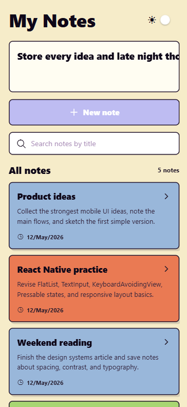
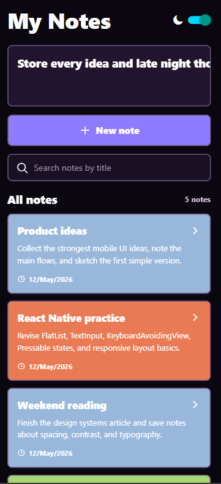
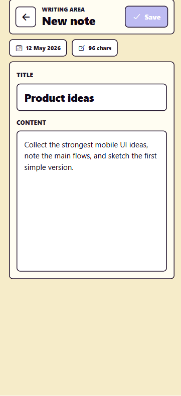

# Notes App UI

A React Native Notes App built with Expo. The Ui includes two screens. On first screen All notes, button to add notes are shown and on second scrren new note or edit note screen is shown.

## Screenshot

<p>
  
  
  
</p>

## Features

- Dark light mode options
- Add new note option
- Edit existing note option
- Display all notes in list view

## Tech Stack

- React Native
- Expo
- Expo Router
- TypeScript

## Getting Started

Install dependencies:

```bash
npm install
```

Start the development server:

```bash
npx expor start
```

You can also run the app on a specific platform:

```bash
npm run android
npm run ios
npm run web
```

## Project Structure

```text
src/app/index.tsx    Main sign-in page screen
assets/              Images and app assets
```

## Linting

Run the linter:

```bash
npm run lint
```
